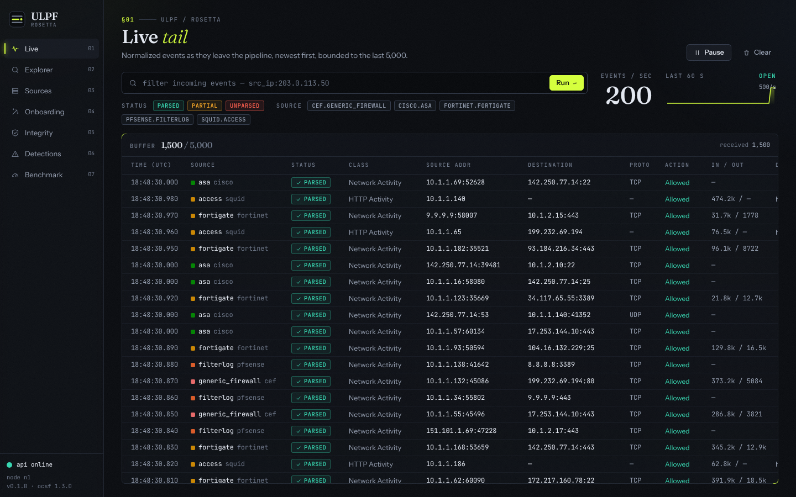
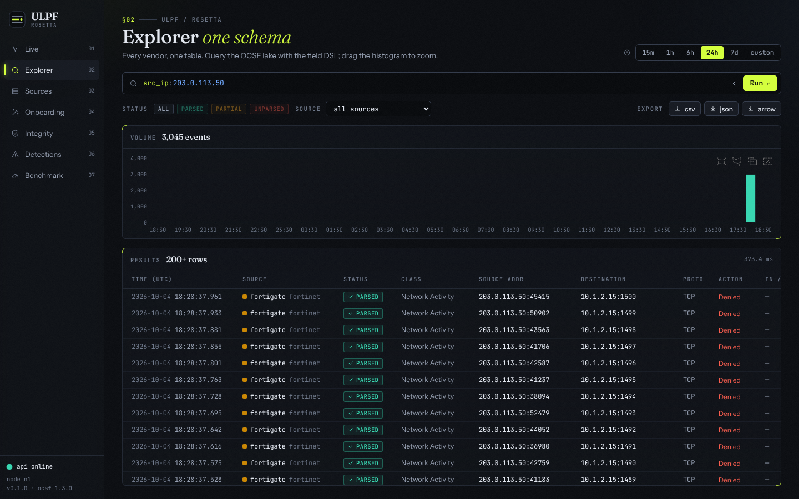
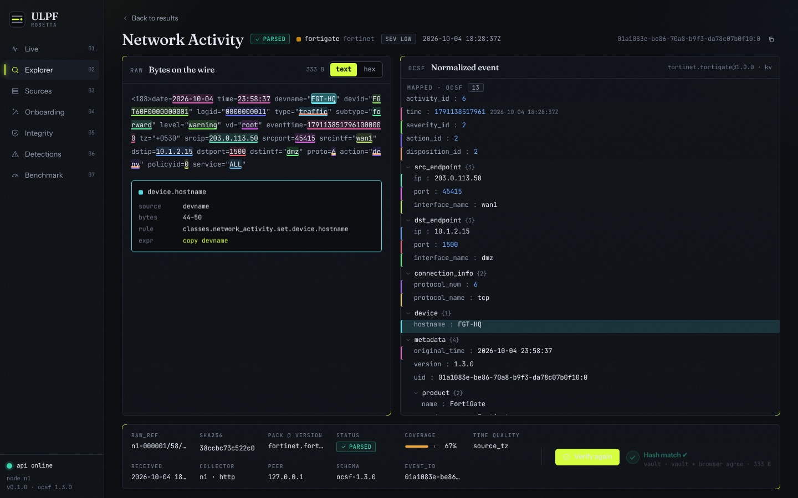
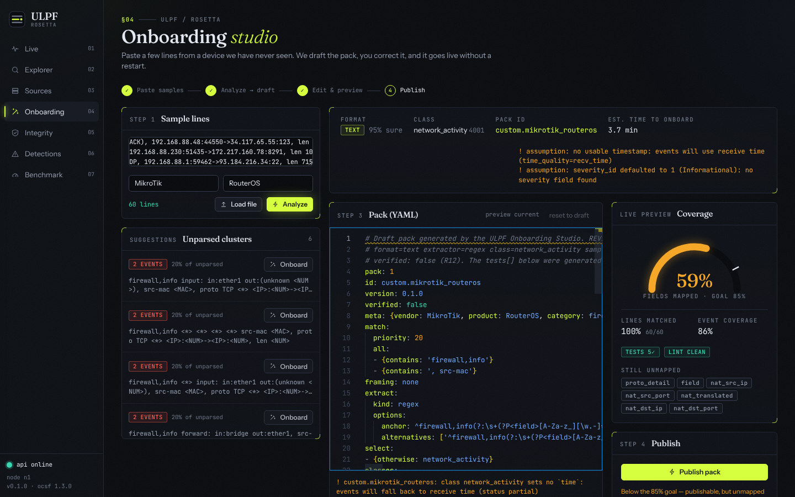
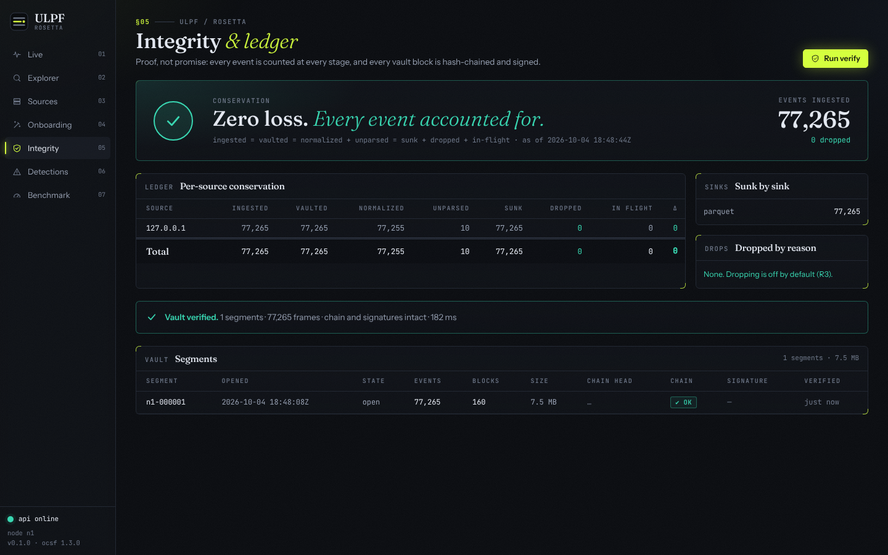
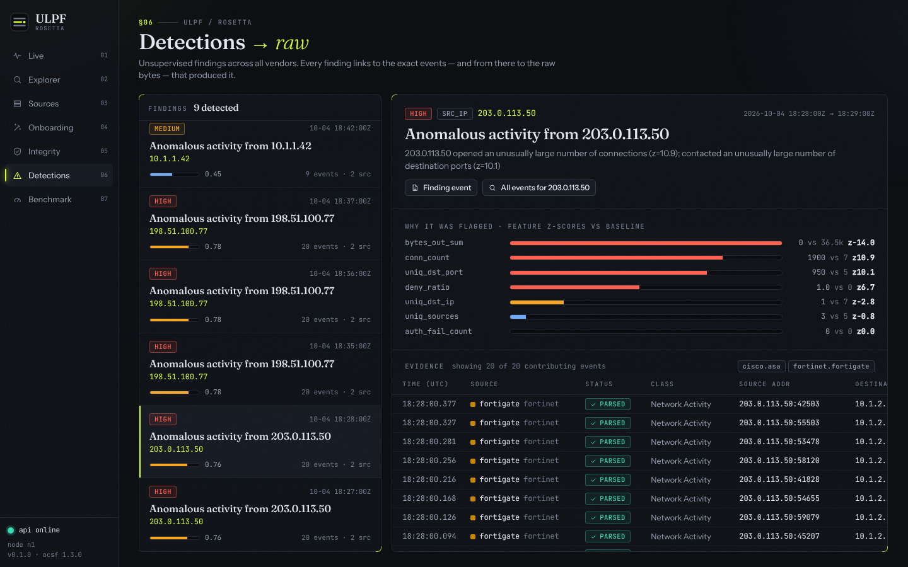

# Tessera (ULPF): Universal Log Pre-processing Framework

> Turns the messy logs from firewalls, IDS/IPS, proxies, routers and DNS servers into **one standard schema (OCSF 1.3)**, **without ever
> losing or altering the original bytes**, and lets you teach it a brand-new log format in minutes. It runs fully offline.
> Built for **SIH 2026 (Smart India Hackathon), problem statement 26156, NTRO**.

**Naming:** *Tessera* is the project name. The Python package, the CLI command, the config keys, the environment variables and the Docker
image are all still called **`ulpf`** (Universal Log Pre-processing Framework). You will see both names; they mean the same thing.

---

## Table of contents

1. [What is this, in plain words](#1-what-is-this-in-plain-words)
2. [Honest status (read this first)](#2-honest-status-read-this-first)
3. [Pick your path](#3-pick-your-path)
4. [Concepts and vocabulary](#4-concepts-and-vocabulary)
5. [Prerequisites](#5-prerequisites)
6. [Quick start A: Docker (recommended for judges and reviewers)](#6-quick-start-a-docker-recommended-for-judges-and-reviewers)
7. [Quick start B: local development (no Docker)](#7-quick-start-b-local-development-no-docker)
8. [Quick start C: offline bundle for an air-gapped machine](#8-quick-start-c-offline-bundle-for-an-air-gapped-machine)
9. [Take the tour: a 10-minute walkthrough](#9-take-the-tour-a-10-minute-walkthrough)
10. [Testing](#10-testing)
11. [CLI reference](#11-cli-reference)
12. [HTTP API quick reference](#12-http-api-quick-reference)
13. [Configuration](#13-configuration)
14. [Sending your own logs in](#14-sending-your-own-logs-in)
15. [Generating test logs](#15-generating-test-logs)
16. [Parser packs: how a log format is described](#16-parser-packs-how-a-log-format-is-described)
17. [Onboarding Studio: add an unseen source](#17-onboarding-studio-add-an-unseen-source)
18. [Benchmarks and measured results](#18-benchmarks-and-measured-results)
19. [Architecture](#19-architecture)
20. [Repository layout](#20-repository-layout)
21. [Troubleshooting](#21-troubleshooting)
22. [Ground rules for contributors](#22-ground-rules-for-contributors)
23. [Documentation map](#23-documentation-map)
24. [Not done](#24-not-done)

---

## 1. What is this, in plain words

Security teams collect logs from many devices. Every vendor writes them differently: syslog text, `key=value` pairs, CEF, LEEF, JSON, XML,
TSV. A SIEM (the system that analyses security events) wants **one schema**, and a forensic investigator wants proof that **no evidence was
changed**. Adding the next unknown device is usually weeks of parser work.

Tessera sits between the devices and the SIEM and does four things:

| Job | How |
|---|---|
| **Keep the original** | Every raw log line is written first to a **vault**: byte-exact, hash-chained, with Ed25519-signed segments. `ulpf verify` finds a single flipped byte. |
| **Normalize** | Lines are parsed by **packs** (YAML data, no code) into the open **OCSF 1.3** schema. Anything a pack does not map is kept in `unmapped`, not thrown away. |
| **Prove it** | Every normalized event carries a lineage (`raw_ref`, `raw_sha256`). The UI can highlight which bytes of the raw line produced which field, and re-verify the hash on demand. A live **conservation ledger** shows that nothing was lost. |
| **Learn new formats** | Paste 20+ lines of an unknown log into the **Onboarding Studio**; it drafts a pack, previews it, and publishes it without a restart. |

It also writes an ML-friendly Parquet data lake, runs a simple anomaly detector (IsolationForest) whose findings click through to the raw
lines, can forward to OpenSearch / Splunk HEC / syslog / JSONL, and ships as a Docker stack that works with **no internet**.

### One log line, before and after

Input (a FortiGate-style line; illustrative, see [status](#2-honest-status-read-this-first)):

```text
<189>date=2026-10-04 time=13:21:07 devname="FGT-HQ" devid="FGT60F0000000001" logid="0000000013" type="traffic" subtype="forward" level="notice" vd="root" eventtime=1790000467000000000 tz="+0530" srcip=10.1.1.15 srcport=51512 srcintf="lan" dstip=142.250.77.14 dstport=443 dstintf="wan1" proto=6 action="accept" policyid=3 service="HTTPS" duration=12 sentbyte=1520 rcvdbyte=48210 sentpkt=14 rcvdpkt=41
```

Output (abridged OCSF Network Activity event; the values are the ones asserted by the pack's first golden test in
[`packs/fortinet/fortigate.yaml`](packs/fortinet/fortigate.yaml)):

```jsonc
{
  "class_uid": 4001, "type_uid": 400106,             // OCSF Network Activity, activity "Traffic"
  "time": 1790000467000,                             // epoch milliseconds, UTC
  "severity_id": 1, "action_id": 1,                  // notice, allowed
  "src_endpoint": { "ip": "10.1.1.15", "port": 51512 },
  "dst_endpoint": { "ip": "142.250.77.14", "port": 443 },
  "connection_info": { "protocol_name": "tcp" },
  "traffic": { "bytes_out": 1520, "bytes_in": 48210 },
  "duration": 12000,
  "device": { "hostname": "FGT-HQ" },
  "unmapped": { "policyid": "3", "...": "every field no rule consumed stays here" },
  "ulpf": {                                          // Tessera's lineage object
    "event_id": "<raw_id>:0",
    "raw_ref": "<segment>/<block>/<idx>",            // exactly where the original bytes live in the vault
    "raw_sha256": "<64 hex chars>",                  // recomputed and compared on every read
    "source_id": "fortinet.fortigate", "pack_version": "1.0.0",
    "status": "parsed", "coverage": 0.9, "time_quality": "..."   // values illustrative
  }
}
```

---

## 2. Honest status (read this first)

* All 10 vendor packs and the log generator are **unverified against real devices** (`verified: false`, rule R12). Accuracy figures measured
  against the generator's ground truth are **self-consistency only, never vendor accuracy**.
* Everything measured was measured on **one shared 2-vCPU VM**. Numbers and caveats: [`docs/benchmarks.md`](docs/benchmarks.md).
* The Onboarding Studio drafts a pack for an unseen source; it does **not** reach the 85% "fields mapped" target on the MikroTik corpus
  (58.8% fields mapped; 98.0% lines matched, 98.0% field recall, 90.9% precision, 87.1% mean coverage). **Review every draft before publishing.**
* Official registry images and a clean, internet-less VM were not available to test the offline bundle on. See [Not done](#24-not-done).
* Native Windows runs the app but not the whole test suite; use WSL2 or Docker for the full experience. Details in
  [Testing on Windows](#testing-on-windows).

---

## 3. Pick your path

| I am... | I want to... | Go to |
|---|---|---|
| A **judge / reviewer** | See it working in a few minutes with the least setup | [Quick start A: Docker](#6-quick-start-a-docker-recommended-for-judges-and-reviewers), then [the tour](#9-take-the-tour-a-10-minute-walkthrough) |
| A **teammate / developer** | Edit code, run tests, hack on packs or the UI | [Quick start B: local dev](#7-quick-start-b-local-development-no-docker), then [Testing](#10-testing) |
| An **operator** with no internet on the target | Install on an isolated machine | [Quick start C: offline bundle](#8-quick-start-c-offline-bundle-for-an-air-gapped-machine) |
| Someone who wants to **add a log source** | Teach it a new format | [Onboarding Studio](#17-onboarding-studio-add-an-unseen-source) or [Packs](#16-parser-packs-how-a-log-format-is-described) |
| Checking the **PS requirements** | Map each requirement to a feature and a proof | [Requirement map](#requirement-map-for-judges) |

### Requirement map for judges

| PS item | Feature | Where to see the proof |
|---|---|---|
| a. Preserve complete raw data | Raw Vault: byte-exact, hash-chained, signed | `ulpf verify`, [tamper demo](#tamper-demo-terminal), UI **Integrity** page |
| b. Extract source-specific attributes | Extractors (kv, regex, json, csv, cef, leef, xml, tsv) + packs | `ulpf packs test packs` |
| c. Normalize to a common taxonomy | OCSF 1.3 classes + `unmapped` bucket | `ulpf validate`, [`tests/golden`](tests/golden) |
| d. Traceability | `raw_ref` + `raw_sha256` + field-to-byte-span **Explain** | UI **Event Detail** page, Verify button |
| e. Plug-and-play onboarding | Drop-in YAML packs, hot reload, **Onboarding Studio** | UI **Studio** page |
| f. Unified visibility | One schema, one explorer, cross-vendor query | UI **Explorer**: `src_ip:203.0.113.50` |
| g. SIEM / data-lake integration | Parquet lake, OCSF JSONL, OpenSearch bulk, Splunk HEC, syslog-out | [`tests/unit/sinks`](tests/unit/sinks), `siem` profile |
| h. AI/ML-ready | Typed Parquet, DuckDB features, anomaly detector | UI **Detections** page, [`docs/ml-ready.md`](docs/ml-ready.md) |
| i. Reduced parser effort | Declarative packs + auto-draft from samples | Studio report (estimated review minutes) |
| j. Air-gapped | Offline bundle + egress-denied test | `make airgap-test`, [`docs/benchmarks.md#air-gap`](docs/benchmarks.md#air-gap) |
| k. Container | One image + compose stack + tarball bundle | [Quick start A](#6-quick-start-a-docker-recommended-for-judges-and-reviewers) |

---

## 4. Concepts and vocabulary

| Term | Meaning |
|---|---|
| **OCSF** | Open Cybersecurity Schema Framework, the open schema we normalize to (version 1.3). We did not invent a schema. Classes used: Network Activity `4001`, HTTP Activity `4002`, DNS Activity `4003`, Authentication `3002`, Detection Finding `2004`, Base Event `0`. |
| **Raw Vault** | Append-only store of the original bytes. Events are grouped in blocks; blocks chain as `H_i = SHA256(H_(i-1) ‖ SHA256(block))`; sealed segments carry an Ed25519 signature over the chain head. Files end in `.ulpfseg`. |
| **`raw_ref`** | Pointer to the original bytes: `<segment>/<block>/<idx>`, for example `n1-000042/17/233`. |
| **Pack** | A YAML file describing one log source: how to recognise it, how to extract fields, how to map them to OCSF, plus golden tests. Packs are data (no code, no `eval`). |
| **Envelope** | A raw event in flight: bytes + a unique `raw_id` assigned at ingest, so redelivery can never create a second event. |
| **Bus** | The queue between ingest and workers: Redis Streams (production, 16 partitions) or an in-process memory bus (`--no-redis`, dev). |
| **Worker** | A process that vaults the raw bytes, detects the format, extracts, normalizes and writes to the sinks. One source maps to one partition, so order per source is preserved. |
| **Terminal status** | Every event ends as exactly one of `parsed`, `partial` (extracted but a required field missing), or `unparsed` (no pack matched; a base event with the message is kept). Nothing is dropped silently. |
| **Unparsed lane** | Where unknown formats go; lines are clustered into templates (Drain) and offered to the Studio as one-click onboarding suggestions. |
| **Lake** | Hive-partitioned Parquet (`class_uid=…/dt=…/hour=…`) with a stable typed schema; queried with DuckDB. |
| **Conservation ledger** | Counters per stage and per source (`ingested`, `vaulted`, `normalized_*`, `unparsed`, `sunk`, `dropped`, `in_flight`). "Conserved" means ingested = vaulted = normalized + unparsed = sunk and nothing was dropped. |
| **Studio** | The Onboarding Studio: samples in, draft pack out, live preview, atomic publish. |
| **Air-gapped** | No network access at runtime, by design and by test (no CDN assets, no telemetry, no external calls). |

The system invariants (each has tests): **I1** raw-first (no sink write before the raw block is fsynced), **I2** never-drop,
**I3** idempotent ids, **I4** plain-Python hot path (slow features never run inline), **I5** order per source. See
[Architecture](#19-architecture).

---

## 5. Prerequisites

| You need | For | Notes |
|---|---|---|
| **Docker** with the **compose plugin** (`docker compose version`) | Quick starts A and C | Docker Desktop on Windows / macOS; Docker Engine on Linux |
| **Python 3.12+** and **[uv](https://docs.astral.sh/uv/)** | Local development, the demo traffic generator, the CLI on your host | uv creates the virtualenv |
| **Node 20+** and **pnpm 9** | Building or developing the UI | Only needed outside Docker; the Docker image builds the UI itself |
| **redis-server** (optional) | Running a node with the Redis bus, and the Redis variants of the tests | Without it, use `--no-redis`; Redis tests are skipped |
| **make** (optional) | Convenience targets | Linux/macOS/WSL. Native Windows has no `make`; see the [make table](#make-targets-and-their-plain-equivalents) |
| **bash** | `make bundle`, `make airgap-test` | Git Bash or WSL on Windows |

**Which OS?** Linux, macOS and **WSL2** are the supported development environments. Native Windows can install the project and run most of
it, but a few tests and scripts assume POSIX (see [Testing on Windows](#testing-on-windows)). Docker works everywhere.

---

## 6. Quick start A: Docker (recommended for judges and reviewers)

This brings up the production topology: Redis, API (also serves the UI), syslog ingest, a worker, and a small gateway container. **All commands
run from the repository root.**

### 6.1 Start it

```bash
git clone <this repository> tessera && cd tessera

docker compose -f docker/compose.yml up -d --build --wait
```

* `--build` builds the `ulpf:dev` image (UI build, Python wheels, runtime). **The build needs internet** (npm and PyPI downloads); the
  *running* stack never does. For an install with no internet on the target, use [Quick start C](#8-quick-start-c-offline-bundle-for-an-air-gapped-machine).
* `--wait` returns when the services report healthy.
* First build takes a few minutes depending on your connection; later starts take seconds.

Check it:

```bash
docker compose -f docker/compose.yml ps
curl -s http://127.0.0.1:8080/api/v1/health         # {"status":"ok", ...}
```

Now open **<http://127.0.0.1:8080>**. The UI loads, and every page says there is no data yet. That is correct: nothing has been sent.

> **Tip:** set `COMPOSE_FILE` once per shell and drop the `-f` flags below.
> bash: `export COMPOSE_FILE=docker/compose.yml`  ·  PowerShell: `$env:COMPOSE_FILE = "docker/compose.yml"`

### 6.2 What is running

| Service | Role | Published to your machine |
|---|---|---|
| `redis` | The bus (Redis Streams, AOF on) | no |
| `api` | FastAPI + the built UI + HTTP ingest (`POST /ingest/raw`) + analytics | via `gateway`, `127.0.0.1:8080` |
| `ingest` | Syslog UDP/TCP listener on 5140, file watcher | via `gateway`, `127.0.0.1:5140` (udp + tcp) |
| `worker` | Vault, detect, extract, normalize, sinks (scale it, see below) | no |
| `gateway` | Tiny port forwarder; the **only** container with a route out | `8080`, `5140/udp`, `5140/tcp` |

The `redis`, `api`, `ingest` and `worker` containers sit on an `internal: true` Docker network (no route out, no external DNS). Docker cannot
publish ports from an internal-only network, so `gateway` joins both the internal network and an `edge` network and forwards 8080 and 5140.
Containers are read-only, non-root, `cap_drop: ALL`, with no default credentials.

By default the ports are bound to **loopback only**. To listen on your LAN (for example so a real firewall can send syslog):

```bash
ULPF_SYSLOG_BIND=0.0.0.0 ULPF_UI_BIND=127.0.0.1 docker compose -f docker/compose.yml up -d
```

> **Security:** the API has **no authentication by default**. Do not bind `ULPF_UI_BIND` to a non-loopback address without setting an API
> token (see [Configuration](#13-configuration)).

### 6.3 Put data in

You have three options. Pick whichever matches what you have installed.

**Option 1: the demo scenario (best, needs the Python environment from [Quick start B](#7-quick-start-b-local-development-no-docker)).**
The traffic generator lives in the source checkout, not inside the image, so run it from the repo on your host:

```bash
ulpf demo --eps 20          # ~40,000 events, three injected incidents, ~15 s; timestamps are shifted to end "now"
```

`ulpf demo` finds the node on `127.0.0.1:8080` and POSTs the scenario to it. Use `--url http://host:8080` for another host.

**Option 2: no Python at all, one line over HTTP.**

```bash
cat > sample.log <<'EOF'
<189>date=2026-10-04 time=13:21:07 devname="FGT-HQ" devid="FGT60F0000000001" logid="0000000013" type="traffic" subtype="forward" level="notice" vd="root" eventtime=1790000467000000000 tz="+0530" srcip=10.1.1.15 srcport=51512 srcintf="lan" dstip=142.250.77.14 dstport=443 dstintf="wan1" proto=6 action="accept" policyid=3 service="HTTPS" duration=12 sentbyte=1520 rcvdbyte=48210 sentpkt=14 rcvdpkt=41
EOF
curl -sS -X POST http://127.0.0.1:8080/ingest/raw -H 'Content-Type: application/x-ndjson' --data-binary @sample.log
```

PowerShell (save the same line to `sample.log` first):

```powershell
Invoke-RestMethod -Method Post -Uri http://127.0.0.1:8080/ingest/raw -ContentType 'application/x-ndjson' -InFile sample.log
```

The body is **newline-separated raw lines**; send as many as you like per request. This sample's event time is a fixed date, so in the
UI's **Explorer** widen the time range ("all"/a custom range) to find it.

**Option 3: real syslog.**

```bash
echo '<189>date=... (your line) ...' | nc -u -w1 127.0.0.1 5140     # UDP
# or point a device / rsyslog / syslog-ng at <host>:5140 (UDP or TCP; octet-counting or newline framing is auto-detected)
```

### 6.4 Look at the result

```bash
curl -s http://127.0.0.1:8080/api/v1/ledger                 # conservation ledger; look for "conserved": true
curl -s "http://127.0.0.1:8080/api/v1/events?limit=3"       # newest events as JSON
```

In the browser, open Live, Explorer, Integrity, Detections ([the tour](#9-take-the-tour-a-10-minute-walkthrough) says what to click).

### 6.5 Everyday Docker commands

| Goal | Command |
|---|---|
| Start / rebuild after code changes | `docker compose -f docker/compose.yml up -d --build --wait` |
| Status | `docker compose -f docker/compose.yml ps` |
| Follow logs (all, or one service) | `docker compose -f docker/compose.yml logs -f` · `... logs -f worker` |
| **Scale workers** | `docker compose -f docker/compose.yml up -d --scale worker=4` |
| Verify the vault inside the stack | `docker compose -f docker/compose.yml exec api ulpf verify --all` |
| Look at stored data | `docker compose -f docker/compose.yml exec api ls -R /data/vault` |
| Open a shell | `docker compose -f docker/compose.yml exec api sh` |
| Restart one service | `docker compose -f docker/compose.yml restart worker` |
| Stop, **keep** data | `docker compose -f docker/compose.yml down` |
| Stop and **delete all data** (vault, lake, Redis) | `docker compose -f docker/compose.yml down -v` |

Data lives in two named volumes (Compose prefixes the project name `ulpf`): `ulpf_ulpf-data` (mounted at `/data`: `vault/`, `lake/`, `out/`,
`packs/custom/`) and `ulpf_redis-data`. `down -v` removes them, including the evidence vault, so use it deliberately.

**Signing key.** The vault signs sealed segments with an Ed25519 key. On first start the node generates one under its data volume. To use your
own, create it and put it where the compose file mounts secrets:

```bash
ulpf keygen secrets/ulpf_ed25519          # writes the seed (mode 0600) and secrets/ulpf_ed25519.pub; `secrets/` is git-ignored
```

**Config changes need a rebuild.** `configs/ulpf.yaml` is baked into the image, so after editing it run `docker compose -f docker/compose.yml up -d --build`.

### 6.6 Optional profiles

```bash
# OpenSearch + Dashboards (SIEM profile)
docker compose -f docker/compose.yml -f docker/compose.siem.yml --profile siem up -d --build
#   1. set sinks.opensearch.enabled: true in configs/ulpf.yaml (then re-run the line above so the image picks it up)
#   2. Dashboards: http://127.0.0.1:5601   (OpenSearch's security plugin is disabled ONLY because the network is internal; do not expose it)

# Local LLM (Ollama) for the OPTIONAL Studio assist; off unless onboard.llm.enabled: true
docker compose -f docker/compose.yml -f docker/compose.ai.yml --profile ai up -d
#   pre-pull a model on an online machine (`ollama pull <model>`) and set onboard.llm.model in configs/ulpf.yaml
```

### 6.7 Prove the air gap

```bash
make airgap-test                       # needs Docker + bash; builds, plays a scenario, then probes from inside api/ingest/worker
bash tools/airgap_test.sh --static-only   # only checks the compose file (internal network, only gateway publishes ports)
```

It asserts that outbound TCP and external DNS **fail from inside** `api`, `ingest` and `worker`, that nothing holds a non-local established
connection, and that the ledger conserved. What was and was not run is in [`docs/benchmarks.md#air-gap`](docs/benchmarks.md#air-gap).

---

## 7. Quick start B: local development (no Docker)

About 5 minutes. This is what you want for editing code, running tests and developing packs.

### 7.1 Linux, macOS, WSL2

```bash
git clone <this repository> tessera && cd tessera

make dev          # uv venv --python 3.12 .venv  +  editable install with the [dev,fast] extras
make ui           # (optional) pnpm install --frozen-lockfile && pnpm build  ->  ui/dist, which the node serves
make verify       # lint + mypy --strict + pytest (about 2 minutes on the reference VM; 1 test skipped)
```

Run a node with an **in-process bus** (no Redis needed), then feed it from a second terminal:

```bash
# terminal 1
.venv/bin/ulpf run --no-redis            # UI + API on http://127.0.0.1:8080, syslog on 5140, POST /ingest/raw

# terminal 2
.venv/bin/ulpf demo --eps 20             # 3 incidents over 30 simulated minutes, ~40k events, aligned to now
```

Or, with **nothing running at all**, `make demo` replays the scenario in-process, runs the anomaly detector, prints the findings and serves
the UI over the result on port 8080.

Activate the environment so you can type `ulpf` instead of `.venv/bin/ulpf`: `source .venv/bin/activate`.

**With Redis (the production path).** Start one (`redis-server`, or `docker run --rm -p 6379:6379 redis:7-alpine`), then:

```bash
ULPF_BUS_URL=redis://127.0.0.1:6379/0 ulpf run --workers 2
```

If Redis is unreachable the command prints a clear message and exits with code 3.

**Where dev data goes.** When `/data` is not writable (the normal case on a laptop), everything lands under `./data/` (git-ignored): `data/vault`,
`data/lake`, `data/out`, `data/packs/custom`. Use `--data-dir <dir>` to choose another place.

### 7.2 Native Windows (PowerShell)

`make` is not installed on Windows by default, and the Makefile hard-codes POSIX paths (`.venv/bin/python`). Use these equivalents. The install
steps below were run and work on Windows 10 with Python 3.12 and uv:

```powershell
git clone <this repository> tessera; cd tessera

uv venv --python 3.12 .venv
uv pip install --python .venv\Scripts\python.exe -e ".[dev,fast]"
.venv\Scripts\Activate.ps1                       # now `ulpf` is on PATH for this shell

ruff check src tests                             # passes
ulpf --help
```

Notes: `uvloop` is Linux/macOS only and is skipped automatically on Windows (the asyncio default loop is used). The UI build is
`cd ui; pnpm install --frozen-lockfile; pnpm build`. For Redis, or to run the full test suite, use **WSL2** or Docker. See
[Testing on Windows](#testing-on-windows).

### 7.3 Make targets and their plain equivalents

| `make ...` | What it runs |
|---|---|
| `dev` | `uv venv --python 3.12 .venv && uv pip install --python .venv/bin/python -e ".[dev,fast]"` |
| `ui` | `cd ui && pnpm install --frozen-lockfile && pnpm build` |
| `lint` | `python -m ruff check src tests` |
| `type` | `python -m mypy --strict src/ulpf/model src/ulpf/vault src/ulpf/packs` |
| `test` | `python -m pytest tests` |
| `verify` | `lint` + `type` + `test` |
| `demo` | `ulpf demo` |
| `bench` | `ulpf bench` |
| `bundle` | `bash tools/make_bundle.sh` |
| `airgap-test` | `bash tools/airgap_test.sh` |
| `ui-smoke` | `ULPF_PY=<abs path to python> node ui/scripts/smoke.mjs` |
| `docs` | prints a pointer to `docs/` |

### 7.4 UI development

```bash
cd ui
pnpm i
pnpm dev            # http://localhost:5173 with a DEV-ONLY mock API (a "dev mock data" badge is shown)
pnpm dev:nomock     # same, proxying /api (and the WebSocket) to $ULPF_API, default http://127.0.0.1:8080
pnpm verify         # typecheck + eslint + vitest + build + offline scan of dist/
```

The UI has no demo data in production builds: every number comes from the API, and an unreachable API shows an explicit error state.
More in [`ui/README.md`](ui/README.md).

---

## 8. Quick start C: offline bundle for an air-gapped machine

**On an online machine** (needs Docker and bash):

```bash
make bundle                                        # or: bash tools/make_bundle.sh
bash tools/make_bundle.sh --with-siem --with-ai    # also bundle OpenSearch/Dashboards and Ollama images
```

This writes `dist/ulpf-offline-<ver>.tar.gz` and a `.sha256` next to it. The tarball contains the Docker images (ulpf, redis, optional
extras), the compose files, `configs/ulpf.yaml`, a sample log, the docs, `SHA256SUMS` and `install.sh`. Wheels are resolved inside the image
build from the committed `requirements.lock`, so they always match the image's Python.

**Carry the tarball to the target** (which needs Docker with the compose plugin), then:

```bash
sha256sum -c ulpf-offline-<ver>.tar.gz.sha256      # optional: verify the transfer
tar xzf ulpf-offline-<ver>.tar.gz && cd ulpf-offline-<ver>
./install.sh                                       # verifies SHA256SUMS, docker load, docker compose up -d
```

* UI and API: <http://127.0.0.1:8080>. Syslog: UDP and TCP `127.0.0.1:5140` (set `ULPF_SYSLOG_BIND=0.0.0.0` to listen on a LAN address).
* No signing key is needed; the node generates one on first start. To use your own, place it at `secrets/ulpf_ed25519` before `./install.sh`.
* Play data into it from any machine that has this repository and its Python environment: `ulpf demo --eps 20 --url http://<target>:8080`.
  Events arrive through the gateway, so the ledger shows the gateway's address as the single source.

---

## 9. Take the tour: a 10-minute walkthrough

Start the stack ([A](#6-quick-start-a-docker-recommended-for-judges-and-reviewers) or [B](#7-quick-start-b-local-development-no-docker)) and
play the demo: `ulpf demo --eps 20`. The scenario has 7 devices (FortiGate, ASA, Suricata, a CEF firewall, pfSense, Squid, a Windows DC) and
three injected incidents: a **port scan** from `203.0.113.50` (minute 10), an **SSH brute force** from `198.51.100.77` (minute 18) and an
**exfiltration** from `10.1.1.42` (minute 25). Open <http://127.0.0.1:8080>.

| # | Page (route) | What to do | What it proves |
|---|---|---|---|
| 1 | **Live** (`#/live`) | Watch the tail; pause; filter with `src_ip:203.0.113.50` | Seven vendors, one schema, one stream; measured events/s |
| 2 | **Explorer** (`#/explorer`) | Query `src_ip:203.0.113.50`; drag a window on the histogram; export CSV/JSON | Cross-vendor query (PS item f); `status:unparsed` shows lines no pack matched |
| 3 | **Event Detail** (`#/event/<id>`) | Click any row. Hover a field in the OCSF tree and see the exact bytes highlighted in the raw line. Press **Verify** | Field-level provenance (PS d); the vault is re-read and the SHA-256 compared |
| 4 | **Sources** (`#/sources`) | Open a source card | Per-source eps, parse rate, coverage, top unmapped fields, schema-drift badge |
| 5 | **Studio** (`#/studio`) | Generate and paste the MikroTik sample (below), Analyze, edit, Preview, Publish | New source in minutes with no restart (PS e). Mind the [caveats](#17-onboarding-studio-add-an-unseen-source) |
| 6 | **Integrity** (`#/integrity`) | Check the conservation table (every Δ is 0); press **Run verify** | Nothing lost (I2); chain and signatures verified, failures pinpointed to segment/block/frame |
| 7 | **Detections** (`#/detections`) | Open a finding, then an evidence row | ML finding to the exact raw line it came from (PS h) |
| 8 | **Benchmark** (`#/benchmark`) | Read the hardware string and charts | Measured, not claimed (it renders `bench/results.json`) |

Feed the Studio an unseen source (a MikroTik firewall, which deliberately has **no pack**):

```bash
python -m tools.loggen --heldout mikrotik --count 60 --out mikrotik.log      # then paste mikrotik.log into the Studio
```

The Studio's coverage meter shows **mean coverage** (87.1% on this sample); the stricter **fields mapped** share is lower (58.8%). Say which one
you mean when you quote it.

### Tamper demo (terminal)

Run on Linux/macOS/WSL. It replays 3,000 events, flips one byte inside a vault segment in a copy, and shows `ulpf verify` catching it.

```bash
python -m tools.loggen --seed 7 --count 3000 --mix fortigate:30,asa:20,suricata:15,cef:10,pfsense:15,squid:10 --out mix.log
ulpf replay --file mix.log --no-redis --data-dir /tmp/vd          # ledger conserved, vault verify PASS
cp -r /tmp/vd /tmp/vd2 && python - <<'PY'
import glob
f = glob.glob('/tmp/vd2/vault/**/*.ulpfseg', recursive=True)[0]
b = bytearray(open(f, 'rb').read()); b[len(b) // 2] ^= 1; open(f, 'wb').write(b)
PY
ulpf verify --all --data-dir /tmp/vd2        # exit 1: "segment n1-000001 block 2 frame None: chain hash mismatch ..."
```

The original passes (`1 segments, 3000 frames: PASS`); the tampered copy fails and names the block. At 1M events the same single flipped
byte is reported with its exact frame, and 94 of 1,000,000 reads fail, all inside that one block (`bench/scale_1m.json`).

### Screenshots (from a live node)

| Live | Explorer | Event Detail |
|---|---|---|
|  |  |  |

| Studio | Integrity | Detections |
|---|---|---|
|  |  |  |

---

## 10. Testing

### 10.1 The one command

```bash
make verify         # = ruff + mypy --strict (model, vault, packs) + pytest
```

On the 2-vCPU reference VM this takes about 2 minutes and **1 test is skipped**. Run it from the repository root with the virtualenv active.

### 10.2 What the suite covers

| Directory | What it tests |
|---|---|
| [`tests/unit/`](tests/unit) | Per-module behavior: analytics, API query DSL, CLI, source detection, explain/byte spans, extractors, syslog framing, log generator, model/ids/envelope/config, time parsing and validation, metrics, onboarding, the pack engine, sinks, the vault |
| [`tests/golden/`](tests/golden) | Every pack's golden vectors; the production engine vs the reference engine on 4,000 generated lines (identical class, fields, `unmapped`, status); accuracy vs the log generator's ground truth |
| [`tests/integration/`](tests/integration) | API, bus conformance (memory **and** Redis), ingest, the full pipeline, runtime/worker pool, scale and conservation, the accuracy-scorer control |
| [`tests/property/`](tests/property) | Hypothesis properties for packs, the pipeline and the vault (round-trips, tamper detection) |
| [`tests/perf/`](tests/perf) | Benchmark harness, per-stage gates, throughput gate, regression gate against `bench/baseline.json` (timing noise is about 15%) |
| [`tests/airgap/`](tests/airgap) | The socket guard is active; non-loopback connections and DNS fail; the UI bundle contains no external URLs |

The whole suite runs under an **egress guard** (`tests/conftest.py`): any connect, send or DNS lookup to a non-loopback address fails the test
that made it. Tests that need `redis-server` start a throwaway one on a free loopback port, or are **skipped** if it is not installed.

### 10.3 Running pieces

```bash
python -m ruff check src tests                                                   # lint (rules E, F, I, B; line length 120)
python -m mypy --strict src/ulpf/model src/ulpf/vault src/ulpf/packs             # strict typing on the core modules
python -m pytest tests                                                           # everything
python -m pytest tests/unit -q                                                   # fast unit tests only
python -m pytest tests/golden                                                    # pack vectors + engine agreement
python -m pytest tests/unit/vault -k tamper                                      # one area, filtered by name
python -m pytest tests/integration/test_bus_conformance.py                       # memory bus always; Redis variant if redis-server exists
python -m pytest tests/perf                                                      # performance gates (needs a quiet machine)
python -m pytest -m "not slow"                                                   # skip tests marked slow
```

Pytest is configured in `pyproject.toml` (`testpaths = ["tests"]`, `asyncio_mode = "auto"`, quiet output, no cache provider).

### 10.4 Pack tests and the Studio evaluation

```bash
ulpf packs lint packs && ulpf packs test packs                          # lint + golden vectors through the production engine
PYTHONPATH=src python -m tools.packref packs                            # same vectors through the independent reference engine
PYTHONPATH=src:. python -m ulpf.onboard.evaluator                       # Studio on 3 held-out sources vs generator truth
```

### 10.5 UI tests

```bash
cd ui
pnpm test           # Vitest: query-bar parser, byte-span highlighter, ring buffer, formatters
pnpm verify         # typecheck + eslint + vitest + build + scan dist/ for external URLs / mock leakage
```

**End-to-end smoke (`make ui-smoke`).** Starts a throwaway node, plays the demo with `ulpf demo`, drives Chromium through all 8 pages (13 checks) and
saves screenshots to `ui/screenshots/live/`. It resolves `playwright-core` and a Chromium binary **from your machine** (nothing is downloaded, per
the no-network rule); set `PLAYWRIGHT_CORE=<dir containing playwright-core>` and `PW_CHROMIUM=<chrome binary>` if they are not found. See the header of
[`ui/scripts/smoke.mjs`](ui/scripts/smoke.mjs).

### 10.6 Measuring instead of asserting

```bash
ulpf bench --workers 1,2,4                    # sustained eps, worker scaling, latency -> bench/results.json (starts a throwaway redis-server)
```

`ulpf bench --redis-url ...` runs against an existing Redis and **FLUSHALL**s it. Do not point it at a Redis you care about.

### Testing on Windows

Observed on native Windows 10 (Python 3.12, 2026-10-05): install and `ruff check` pass, but **6 unit tests fail** and `tests/perf` cannot be
collected. They are all POSIX assumptions in the code or tests, not logic bugs:

| Failure | Cause |
|---|---|
| `test_cli.py::test_keygen_and_pinned_pubkey`, `test_vault.py::test_seal_verify_signature_and_pinning` | Asserts the key file mode is `0600`; Windows reports `0666` |
| `test_vault.py::test_sigkill_midwrite_recovers` | Uses `signal.SIGKILL`, which does not exist on Windows |
| `test_model_ids_envelope_config.py::test_config_defaults_and_shipped_yaml`, `test_sinks.py::test_parquet_layout_flush_rules_and_roundtrip` | Hard-coded `/` path separators in assertions |
| `test_timeparse_validate.py::test_tz_bad_and_iana` | `Asia/Kolkata` needs IANA zone data; Windows has none by default (installing the `tzdata` package is the likely fix; not tried) |
| `tests/perf/*` | `os.sysconf` (used by the bench module) is POSIX-only |

**Use WSL2 (or a Linux/macOS machine, or the Docker image) to run the full suite.** `ulpf run`, `ulpf demo` and the UI build were not exercised on native
Windows; the demo also builds a `PYTHONPATH` with `:` separators, so treat it as POSIX-only for now.

---

## 11. CLI reference

`ulpf --help` lists commands; `ulpf <command> --help` lists options. All commands that touch data accept `--config/-c <file>` (default `$ULPF_CONFIG`,
else `configs/ulpf.yaml`) and `--data-dir <dir>` (moves every `/data/...` path under that directory).

| Command | What it does | Key options | Exit codes |
|---|---|---|---|
| `ulpf run` | Run a node: syslog/file/HTTP ingest, workers, API + UI | `--role all\|api\|ingest\|worker` (default `all`), `--workers N`, `--no-redis` | `2` bad role, `3` Redis unreachable |
| `ulpf demo` | Play the 30-minute, 3-incident scenario into a node (or standalone) | `--url`, `--eps 100`, `--rate 3000`, `--scenario-clock`, `--no-serve`, `--token` | `1` node refused/unreachable, `2` scenario not found |
| `ulpf replay` | Push a log file through vault, packs, OCSF JSONL and Parquet; print the conservation ledger | `--file/-f` (required), `--hint <pack id>`, `--rate max\|N`, `--no-redis`, `--workers N`, `--limit N`, `--no-jsonl` | `0` conserved and vault verified, `1` otherwise, `3` Redis unreachable |
| `ulpf verify` | Recompute every frame hash, the chain and the signatures; say where the first failure is | `--all`, `--segment/-s`, `--pubkey <hex file>`, `--vault-dir` | `1` on any failure |
| `ulpf keygen [path]` | Generate the Ed25519 signing key (default `ulpf_ed25519`, plus `<path>.pub`) | | |
| `ulpf validate` | OCSF conformance check of a JSONL file of normalized events | `--events <file>` | `1` if any violation |
| `ulpf packs lint [path]` | Lint packs: unknown ops/OCSF paths, ReDoS-prone regexes, missing tests, `verified` rule | `--min-tests 5`, `--allow-verified` | `1` on any error |
| `ulpf packs test [path]` | Run each pack's golden vectors through the production engine | | `1` on any failure |
| `ulpf bench` | Measure sustained eps, worker scaling and latency of the real pipeline | `--events 200000`, `--workers 1,2`, `--latency-secs 20`, `--out bench/results.json`, `--redis-url` | `1` if the ledger did not conserve |

Examples:

```bash
ulpf replay --file mix.log --no-redis --data-dir ./data/replay        # one-shot, no services, writes vault + lake + JSONL
ulpf verify --all --data-dir ./data/replay                            # recompute hashes, chain, signatures
ulpf verify --vault-dir /some/vault --pubkey ulpf_ed25519.pub         # pin the trusted public key
ulpf validate --events <file>.jsonl                                   # check a JSONL file of normalized events (one file per call)
```

---

## 12. HTTP API quick reference

Base: `http://127.0.0.1:8080`. JSON, epoch-millisecond UTC times, errors as `{"error":{"code","message"}}`. The authoritative contract is
[`docs/api-contract.md`](docs/api-contract.md) and [`ui/src/api/types.ts`](ui/src/api/types.ts).

| Endpoint | Purpose |
|---|---|
| `POST /ingest/raw` | Ingest newline-separated raw lines (outside `/api/v1`) |
| `GET /api/v1/health` | Liveness and version |
| `GET /api/v1/events` | Search (`from`, `to`, `class`, `source`, `status`, `q`, `limit` up to 500, `cursor`) |
| `GET /api/v1/events/histogram` · `/fields` · `/values` | Histogram buckets; field list; autocomplete hints |
| `GET /api/v1/events/{id}` | The full OCSF document |
| `GET /api/v1/events/{id}/raw` | Exact raw bytes (base64) re-read from the vault, with expected vs actual SHA-256 |
| `GET /api/v1/events/{id}/explain` | Which raw byte spans produced which OCSF fields |
| `WS /api/v1/stream` | Live tail (filters sent as JSON messages) |
| `GET /api/v1/sources` · `/sources/{id}/health` | Per-source stats and health |
| `GET /api/v1/ledger` | Conservation ledger |
| `GET /api/v1/vault/segments` · `POST /api/v1/vault/verify` | Segment list; streaming (NDJSON) verification |
| `GET /api/v1/analytics/detections` | Findings with evidence |
| `GET /api/v1/onboard/clusters` · `POST .../analyze` · `.../preview` · `.../publish` | The Studio's backend |
| `GET /api/v1/benchmark` | Serves `bench/results.json` |
| `GET /api/v1/export/{csv\|json\|arrow}` | Export a query result |
| Prometheus metrics | Text format (see the contract) |

Try it:

```bash
curl -s http://127.0.0.1:8080/api/v1/health
curl -s "http://127.0.0.1:8080/api/v1/events?q=src_ip:203.0.113.50&limit=5"
curl -s http://127.0.0.1:8080/api/v1/ledger
```

**Query language** (the `q` parameter and the UI query bar): terms are AND-ed; `field:value`; prefix `-` negates.

```text
src_ip:203.0.113.50                      one value
src_ip:10.0.0.0/8                        CIDR; also trailing wildcards, 10.1.*
dst_port:22,2222                         comma list = OR
dst_port:1000..5000                      numeric range
bytes_out:>=1000000                      operators >= <= > <  (numeric/time fields)
action:denied   status:unparsed          action is an alias over action_id
"failed password"                        bare or quoted text matches the raw message
-source_id:cisco.asa                     negation
```

Fields: `src_ip dst_ip src_port dst_port proto_name proto_num action action_id activity_id severity_id class_uid status source_id bytes_in
bytes_out packets_in packets_out duration_ms user_name url http_method http_status dns_query signature device_host coverage event_id raw_ref`.

**Auth.** Off by default. Set `ULPF_API_TOKEN` (or `api.token`) and send `Authorization: Bearer <token>`; the WebSocket and downloads also accept
`?access_token=<token>`. In the UI, set `localStorage.ulpf_token`.

---

## 13. Configuration

One YAML file ([`configs/ulpf.yaml`](configs/ulpf.yaml)), validated strictly at startup: **unknown or misspelled keys are an error**. Order of
precedence: the YAML file, then environment variables, then explicit overrides.

### Environment variables

| Variable | Effect |
|---|---|
| `ULPF_CONFIG` | Path to the YAML file (the image sets `/app/configs/ulpf.yaml`) |
| `ULPF_NODE_ID` | `node_id` (prefixes vault segment names, e.g. `n1-000042`) |
| `ULPF_BUS_URL`, `ULPF_BUS_KIND` | Redis URL; `redis` or `memory` |
| `ULPF_API_TOKEN` | Static bearer token for the API |
| `ULPF_DATA_DIR`, `ULPF_VAULT_DIR`, `ULPF_LAKE_DIR` | Data locations |
| `ULPF_SIGNING_KEY` | Path to the Ed25519 seed file |
| `ULPF_UI_BIND`, `ULPF_SYSLOG_BIND`, `ULPF_VERSION` | **Compose only**: host bind address of the UI/API and of syslog; image tag |
| `ULPF_API` | UI dev server only: backend URL for `pnpm dev:nomock` |

The compose file only passes `ULPF_CONFIG` into the containers. To set `ULPF_API_TOKEN` in Docker, add it under `environment:` in
`docker/compose.yml`.

### Main sections

| Section | Important keys (defaults) |
|---|---|
| `node_id` | `n1` |
| `bus` | `kind` redis or memory · `url` · `partitions` 16 · `maxlen` 2,000,000 |
| `ingest` | `syslog_udp` / `syslog_tcp` listen `0.0.0.0:5140` (`framing`: auto, octet, newline) · `syslog_tls` (off; cert/key) · `http` (`path` `/ingest/raw`, optional `token`) · `file_watch: [{path, hint}]` · `max_event_bytes` 65536 |
| `vault` | `dir` · `block_events` 1000 · `block_max_ms` 500 · `segment_max_mb` 256 · `fsync` block or none · `signing_key` |
| `pipeline` | `workers` `auto` (CPU count minus 1, at least 1) · `source_cache` · `default_tz` UTC · `drop_unparsed` **false** (dropping is explicit and counted) |
| `packs` | `dirs` (built-in packs, then the custom dir the Studio publishes to) · `hot_reload` true |
| `sinks` | `parquet` (on; `flush_rows` 50,000, `flush_secs` 5) · `jsonl` (off) · `opensearch` (off) · `splunk_hec` (off) · `syslog_out` (off) |
| `analytics` | `enabled` true · `window_s` 60 |
| `onboard.llm` | `enabled` **false** · `endpoint` · `model` (local only; never in the hot path) |
| `api` | `listen` `0.0.0.0:8080` · `token` · `cors_origins` · `max_body_bytes` 8 MiB · `ui_dir` |

### Ports

| Port | Protocol | What |
|---|---|---|
| 8080 | TCP | UI, REST API, WebSocket, HTTP ingest |
| 5140 | UDP and TCP | Syslog ingest (unprivileged on purpose) |
| 5601 | TCP | OpenSearch Dashboards (only with the `siem` profile) |
| 6379 | TCP | Redis (internal in Docker) |
| 5173 | TCP | UI dev server (`pnpm dev`) |

### Where data lives

| What | Docker (`/data` volume) | Local dev |
|---|---|---|
| Raw Vault (`*.ulpfseg`) | `/data/vault` | `data/vault` |
| Parquet lake | `/data/lake` | `data/lake` |
| JSONL output (when enabled) | `/data/out` | `data/out` |
| Packs published by the Studio | `/data/packs/custom` | `data/packs/custom` |

Querying the lake directly with DuckDB (any machine, any tool that reads Parquet):

```python
import duckdb
duckdb.sql("SELECT src_ip, count(*) c FROM 'data/lake/class_uid=4001/**/*.parquet' GROUP BY 1 ORDER BY c DESC LIMIT 10").show()
```

More in [`docs/ml-ready.md`](docs/ml-ready.md); [`examples/notebook.py`](examples/notebook.py) runs the generate, window, fit, score, findings flow end to end.

---

## 14. Sending your own logs in

| Method | How |
|---|---|
| **Syslog UDP / TCP** | Point a device at `<host>:5140`. TCP framing (octet-counting or newline) is auto-detected. Optional TLS listener (`ingest.syslog_tls`). |
| **HTTP** | `POST /ingest/raw` with newline-separated lines (`Content-Type: application/x-ndjson`); add the bearer token if one is configured. |
| **File watch** | Set `ingest.file_watch: [{path: "/data/in/*.log", hint: "fortinet.fortigate"}]`; the node tails matching files. |
| **Replay** | `ulpf replay --file x.log --no-redis` for a one-shot offline run. |

`hint` forces a pack id when you already know the source; otherwise the format is sniffed and matched to a pack automatically, and unknown lines go
to the unparsed lane (never dropped).

---

## 15. Generating test logs

```bash
python -m tools.loggen --seed 7 --count 100000 \
  --mix fortigate:30,asa:20,suricata:15,cef:10,pfsense:15,squid:10 --out mix.log
```

Deterministic per seed. `--out` also writes `<out>.truth.jsonl` (one record per line: source, expected OCSF fields, optional incident tag) which is how
accuracy is scored. Formats: `fortigate asa suricata cef pfsense squid zeek windows leef dnsmasq`. `--heldout mikrotik|sophos_kv|juniper_srx`
emits the unseen sources used to test onboarding (there is intentionally no MikroTik pack).

> **Warning.** Do **not** run the demo scenario at its file-default rate: `python -m tools.loggen --scenario tools/loggen/scenarios/demo.yaml` writes about
> **3.6 million events (~2.7 GB with truth)**. Add `--eps 20` for the ~40k-event version that `ulpf demo --eps 20` uses.

Run these from the repository root with the environment active (the generator is `tools/`, not an installed package).

---

## 16. Parser packs: how a log format is described

A pack is YAML: how to recognise a source, which extractor to use, which OCSF class to produce, how to map fields, and golden tests. The shipped
packs (all `verified: false`):

| Pack | Format | Vendor / source |
|---|---|---|
| `packs/fortinet/fortigate.yaml` | syslog + key=value | Fortinet FortiGate |
| `packs/cisco/asa.yaml` | syslog + regex | Cisco ASA |
| `packs/suricata/eve.yaml` | JSON | Suricata EVE |
| `packs/cef/generic_firewall.yaml` | CEF | Generic CEF firewall |
| `packs/leef/generic.yaml` | LEEF | Generic LEEF |
| `packs/pfsense/filterlog.yaml` | CSV (position-dependent) | pfSense filterlog |
| `packs/squid/access.yaml` | text | Squid proxy |
| `packs/zeek/conn.yaml` | TSV | Zeek conn log |
| `packs/windows/event_xml.yaml` | XML | Windows event log |
| `packs/dns/dnsmasq.yaml` | syslog text | dnsmasq |

Skeleton (see [`packs/fortinet/fortigate.yaml`](packs/fortinet/fortigate.yaml) for a complete, tested example):

```yaml
pack: 1
id: vendor.product                  # shipped packs: dotted lowercase; Studio packs: custom.<slug>
version: 1.0.0
verified: false                     # must stay false until a human checks it against a real device
meta: {vendor: ..., product: ..., category: firewall}
match:   {priority: 50, all: [ {contains: "devname="}, {contains: "logid="} ]}
framing: syslog                     # strip the RFC 3164/5424 header first (exposed as syslog.*)
extract: {kind: kv, options: {pair_sep: " ", kv_sep: "=", quote: '"'}}
select:  [ {when: {field: type, eq: traffic}, class: network_activity}, {otherwise: base_event} ]
classes:
  network_activity:
    set:
      src_endpoint.ip: {from: srcip, pipe: [ip]}
      src_endpoint.port: {from: srcport, pipe: [int, port]}
tests:                              # at least 5 for shipped packs; each is raw line -> expected OCSF values
  - name: example
    raw: '<189>date=... devname="FGT-HQ" ... srcip=10.1.1.15 srcport=51512 ...'
    expect: {class_uid: 4001, src_endpoint.ip: 10.1.1.15, src_endpoint.port: 51512}
```

Workflow: edit the YAML, then

```bash
ulpf packs lint packs        # unknown ops/OCSF paths, ReDoS-prone regexes, missing tests, verified rule
ulpf packs test packs        # every golden vector through the production engine
```

Packs are **hot-reloaded** by running workers (`packs.hot_reload`). The expression language is a closed set of operations (`str int float lower upper
strip ip port mac epoch_s epoch_ms epoch_ns iso8601 strptime lookup regex split concat mul proto_name hms`), with no code and no `eval`. A field is
counted as *consumed* only when an expression using it produced a value; the rest stays in `unmapped`, so nothing vanishes. Full reference:
[`docs/pack-dsl.md`](docs/pack-dsl.md).

---

## 17. Onboarding Studio: add an unseen source

1. Open the **Studio** page (`#/studio`) and paste **at least 20 lines** of the unknown log (optionally a vendor/product label).
2. **Analyze.** It sniffs the format (syslog framing, JSON, CEF, LEEF, XML, TSV, kv, CSV, free text), mines line templates (Drain, then alignment into
   one or a few regexes), infers field types, suggests OCSF paths from a vocabulary file ([`src/ulpf/onboard/aliases.yaml`](src/ulpf/onboard/aliases.yaml),
   which you can extend without code), and drafts a pack with generated tests. The report shows lines matched, mean coverage, fields mapped, the
   unmapped list, assumptions (for example an assumed timezone) and an *estimated* review time.
3. **Edit** the YAML in the Monaco editor; the preview re-runs about 650 ms after each keystroke with lint markers.
4. **Publish.** The pack is validated, written atomically to `<data dir>/packs/custom/<id>.yaml`, and workers swap it in with no restart.
   Published packs get an id `custom.[a-z0-9_]+`, must pass lint and every test, and always ship `verified: false`.

From code: `ulpf.onboard.studio.analyze(lines)` gives a draft pack and report, then `preview(...)`, then `publish(...)`.

The optional **local LLM assist** is off by default and local-only (loopback, RFC 1918, or a single-label hostname). A patch is accepted only if
it lints, passes all tests and strictly raises coverage; otherwise the draft is returned unchanged. The system never depends on it.

**Be realistic about the results.** On three held-out sources (60 training lines, 400 unseen), analysis takes under 0.3 s, but the 85% "fields
mapped" target is **not met** on any of them (MikroTik 58.8%, Sophos-style 73.1%, Juniper-SRX-style 41.4%). The ground truth was written by the same
author as the suggester vocabulary, and the review-time figure is the Studio's estimate, not a measured human time. Always review a draft.
Details: [`docs/onboarding.md`](docs/onboarding.md).

---

## 18. Benchmarks and measured results

Measured on a shared 2-vCPU Xeon 2.1 GHz VM (7.8 GB, Python 3.12.3); run-to-run noise is about 15%. Method and caveats:
[`docs/benchmarks.md`](docs/benchmarks.md). Raw results: `bench/results.json`, `bench/scale_1m.json`, `bench/baseline.json`.

| Metric | Target | Measured |
|---|---|---|
| Conservation at 1M events | 100%, 0 lost | 1,000,000 in = vaulted = sunk; parsed 998,840 + partial 143 + unparsed 1,017; lost 0 |
| Raw retrievability and hash verify | 100% | 1,000,000 vault frames verified |
| Tamper detection | detect | 1 flipped byte: `ulpf verify` exit 1 at segment/block/frame; 94 of 1M reads fail, all in that block |
| Parse success, clean generated lines | at least 99% | 998,000 of 998,000 |
| Field precision / recall vs generator truth | at least 99% | 1.0000 / 1.0000 (self-consistency only) |
| Throughput, full pipeline, all sinks | 10k eps on 4 cores | 6,784 / 13,329 / 14,588 eps with 1 / 2 / 4 workers on **2 vCPUs** (worker capacity, not end-to-end ingest); **not measured on 4 cores** |
| Worker scaling | near-linear | 1.96x from 1 to 2 workers; flat beyond the 2 physical cores |
| Ingest to queryable latency | p99 < 10 s | p50 25 ms, p95 57 ms, p99 95 ms at about 50% of one worker's rate |
| Anomaly findings (generated data) | n/a | 3 of 3 incidents flagged, 0 of 4,249 baseline windows false positives |
| New-source onboarding | under 3 min, 85% mapped | analysis 0.03 to 0.29 s; fields mapped 41 to 73% (**not met**) |
| Air-gap | passes | passed with locally substituted base images (see the benchmarks doc) |

Reproduce on your machine: `ulpf bench --workers 1,2,4`, then open the Benchmark page.

---

## 19. Architecture

```text
 sources ──► INGEST (asyncio) ──► BUS (Redis Streams, 16 partitions) ──► WORKERS xN (processes)
 syslog UDP/TCP/TLS, HTTP POST,    RawEnvelope(raw_id, bytes)           1 VAULT   append, fsync per block (raw-first, hash-chained)
 file tail / replay                                                      2 DETECT  source cache -> sniff -> pack match
                                                                         3 EXTRACT kv / regex / json / csv / cef / leef / xml / tsv
                                                                         4 NORMALIZE pack -> OCSF + unmapped + ulpf lineage
                                                                         5 UNPARSED lane (base event + template id)
                                                                         6 SINKS   Parquet lake, JSONL, OpenSearch, HEC, syslog
 API (FastAPI) + DuckDB over Parquet + WebSocket tail      ANALYTICS (60 s windows -> IsolationForest -> findings)
 ONBOARD Studio (slow path, optional local LLM, off)       UI (React/TypeScript, bundled fonts + Monaco, zero external requests)
```

| Inv. | Invariant | How it is checked |
|---|---|---|
| I1 | Raw-first: no sink write before the raw block is fsynced | integration tests; the vault `append` returns the `raw_ref` before normalization |
| I2 | Never-drop: one terminal status and a raw ref per event | conservation ledger; 1M-event run with `lost = 0` |
| I3 | Idempotent ids: redelivery cannot mint a second `event_id` | redelivery tests; duplicates collapse on read and in the compactor |
| I4 | Hot path is plain Python: no per-event logging or regex compile; slow features never inline | per-stage perf gates |
| I5 | Order per source: one source = one partition = one worker | scaling tests |
| R5/R6 | No network at runtime; no LLM in the hot path | suite-wide socket guard, UI bundle scan, compose test |

Workers lease partitions through Redis (`SET NX EX`); rebalancing and crash takeover are tested with two workers. Multi-container scaling under
Docker was not run. Deeper reading: [`docs/architecture.md`](docs/architecture.md) (two pages), [`docs/lineage-spec.md`](docs/lineage-spec.md),
[`docs/IMPLEMENTATION_GUIDE.md`](docs/IMPLEMENTATION_GUIDE.md) (the original build spec).

---

## 20. Repository layout

```text
packs/        Parser packs (YAML data), one folder per vendor
src/ulpf/     The backend (installable package `ulpf`)
  ingest/       syslog UDP/TCP/TLS, HTTP, file replay/tail, framing, publisher
  bus/          Redis Streams bus and the in-process memory bus
  vault/        Raw Vault: segment format, writer, reader, integrity (verify)
  detect/       format sniffing, source cache, pack matching
  extract/      kv, regex, json, csv, cef, leef, xml, tsv extractors
  packs/        pack schema, loader, compiler, DSL ops, linter, test runner
  normalize/    mapper to OCSF, time parsing, validation, lake schema
  pipeline/     worker, router, runtime (run_node), conservation ledger, leases, unparsed lane, bench
  sinks/        parquet, jsonl, opensearch, splunk_hec, syslog_out, live tail
  explain/      field -> byte-span tracer
  api/          FastAPI app and routes (events, sources, integrity, analytics, onboard), DuckDB lake, query DSL, WebSocket
  analytics/    windowed features, IsolationForest anomaly detector, OCSF findings
  onboard/      Studio: miner, inferer, suggester, aliases.yaml, reference engine, evaluator, optional LLM
  model/        OCSF event, envelope, ids, lineage (strictly typed)
  cli.py        the `ulpf` command         config.py  strict config loading
ui/           React + TypeScript console (src/pages, src/components, src/api, dev-mock for `pnpm dev`)
tools/        loggen (log generator), bench harness, make_bundle.sh, airgap_test.sh, packref, vendor_ocsf.py
docker/       Dockerfile, compose.yml (+ siem, ai profiles), fwd.py (gateway forwarder)
configs/      ulpf.yaml (the default config)
tests/        unit, golden, integration, property, perf, airgap
docs/         architecture, demo, demo-script, slides, pack-dsl, lineage-spec, onboarding, benchmarks, ml-ready, api-contract, IMPLEMENTATION_GUIDE
bench/        recorded benchmark results and the perf-gate baseline
examples/     notebook.py (generate, window, fit, score, findings)
```

`LOCAL_BUILD.md` is a historical record of the agent prompts used to build this repository, not user documentation.

---

## 21. Troubleshooting

| Symptom | Cause and fix |
|---|---|
| `make : The term 'make' is not recognized` (PowerShell) | Native Windows has no `make`. Use the [PowerShell steps](#72-native-windows-powershell) or the [plain equivalents](#73-make-targets-and-their-plain-equivalents), or use WSL2. |
| `uvloop does not support Windows` while installing | Already handled: `uvloop` is only requested on non-Windows platforms. Re-pull and reinstall. |
| `cannot reach Redis at redis://...` (exit 3) | No Redis. Start one and set `ULPF_BUS_URL`, or run with `--no-redis`. (`redis` is only a valid hostname inside the compose network.) |
| UI shows "can't reach the API" | The node is not running or not on 8080. Check `curl http://127.0.0.1:8080/api/v1/health` and `docker compose ... ps`. |
| `http://127.0.0.1:8080` serves JSON but not the UI (local dev) | The UI was not built. Run `make ui` (or `cd ui && pnpm install --frozen-lockfile && pnpm build`). The Docker image builds it for you. |
| Pages are empty after sending data | Time range. Events carry their own timestamps; widen the Explorer range. `ulpf demo` shifts the scenario to end "now" for exactly this reason. |
| `ulpf demo`: "scenario not found" | Run it from a source checkout; the scenario and generator are not in the Docker image. |
| `ulpf demo` created a multi-GB file | You ran `tools.loggen` on the demo scenario without `--eps`. Use `--eps 20`. Delete the temp file. |
| `docker compose up --build` fails to download | The **build** needs internet (npm, PyPI). Build on an online machine and use the [offline bundle](#8-quick-start-c-offline-bundle-for-an-air-gapped-machine). |
| Port 8080 or 5140 already in use | Stop the other process, or change the published ports in `docker/compose.yml` (for local dev, `api.listen` / `ingest.syslog_*`). |
| My `configs/ulpf.yaml` change has no effect in Docker | The file is baked into the image: add `--build`. |
| Config error mentioning "extra fields not permitted" | The config is strict; a key is misspelled or in the wrong section. |
| `ulpf verify` prints `no segments found` | Wrong data directory. Pass the same `--data-dir` you ran with (dev default: `./data`), or `--vault-dir`. |
| Redis-backed tests are skipped | `redis-server` is not on `PATH`. Install it (Linux: `apt install redis-server`; macOS: `brew install redis`) or use WSL2. |
| A few tests fail on native Windows | Known POSIX assumptions; see [Testing on Windows](#testing-on-windows). |
| `ui-smoke`: "playwright-core not found" | Set `PLAYWRIGHT_CORE` and `PW_CHROMIUM` (see [UI tests](#105-ui-tests)). |
| Docker volumes are full / I want a clean slate | `docker compose -f docker/compose.yml down -v` (**deletes the vault and lake**). |
| Git warns "LF will be replaced by CRLF" | Harmless line-ending conversion on Windows. |

---

## 22. Ground rules for contributors

These come from the build spec ([`docs/IMPLEMENTATION_GUIDE.md`](docs/IMPLEMENTATION_GUIDE.md) section 0). Please keep them true.

| Rule | In short |
|---|---|
| R1 | Python, TypeScript/JavaScript, YAML, SQL, Bash and Markdown only. No Go, C++, Rust or Java in our code. |
| R3 | **Never silently drop an event.** Every event ends `parsed`, `partial` or `unparsed`, with a durable raw copy. |
| R4 | **Raw-first.** Nothing reaches a sink before its raw bytes are durable in the vault. |
| R5 | **No network at runtime.** No CDN assets, telemetry, downloads or external API calls. |
| R6 | **No LLM in the hot path.** The optional local LLM assists onboarding only. |
| R7 | No `eval`, `exec`, `pickle` or unsafe YAML. Packs are data. |
| R8 | Hot-path discipline: no per-event logging or regex compilation; batch everything. |
| R9 | The UI shows only real API data. No hard-coded demo numbers in `ui/`. |
| R10 | Every module ships with tests. Done means `make verify` is green. |
| R11 | Only allow-listed dependencies. |
| R12 | Sample logs are illustrative; packs stay `verified: false` until a human checks them against a real device. Do not claim vendor accuracy. |

Before opening a pull request: `make verify` (plus `cd ui && pnpm verify` if you touched the UI) and, if you touched a pack, `ulpf packs lint packs && ulpf packs test packs`.

---

## 23. Documentation map

| Document | Read it for |
|---|---|
| [`docs/architecture.md`](docs/architecture.md) | Two-page problem, approach, invariants, schema, Studio and measured results |
| [`docs/demo.md`](docs/demo.md) · [`docs/demo-script.md`](docs/demo-script.md) | Running and presenting the demo |
| [`docs/pack-dsl.md`](docs/pack-dsl.md) | The pack language: expressions, ops, extractors, limits |
| [`docs/lineage-spec.md`](docs/lineage-spec.md) | The `ulpf` lineage object and the guarantees consumers can rely on |
| [`docs/onboarding.md`](docs/onboarding.md) | The Studio pipeline, optional LLM, held-out evaluation, weaknesses |
| [`docs/benchmarks.md`](docs/benchmarks.md) | Throughput, scaling, 1M-event conservation, accuracy, air-gap, with method and caveats |
| [`docs/ml-ready.md`](docs/ml-ready.md) | Lake schema and the anomaly baseline |
| [`docs/api-contract.md`](docs/api-contract.md) | Every endpoint and shape the UI uses |
| [`docs/slides.md`](docs/slides.md) | The 5-slide outline |
| [`docs/IMPLEMENTATION_GUIDE.md`](docs/IMPLEMENTATION_GUIDE.md) | The original build spec (rules, contracts, milestones) |
| [`ui/README.md`](ui/README.md) | UI scripts, pages, design notes |
| [`tools/loggen/import_public.md`](tools/loggen/import_public.md) | Importing public log samples next to generated truth |

---

## 24. Not done

* **ECS export** (a P2 item) was not built.
* Official registry images and a clean, internet-less VM were not available to test the offline bundle on.
* **Vendor sample accuracy**, benchmarks on the final demo hardware and the recorded demo video are human tasks.
* Throughput was not measured on a 4-core machine; multi-container worker scaling under Docker was not run.
* The test suite and a few scripts assume POSIX; native Windows is partial (see [Testing on Windows](#testing-on-windows)).
